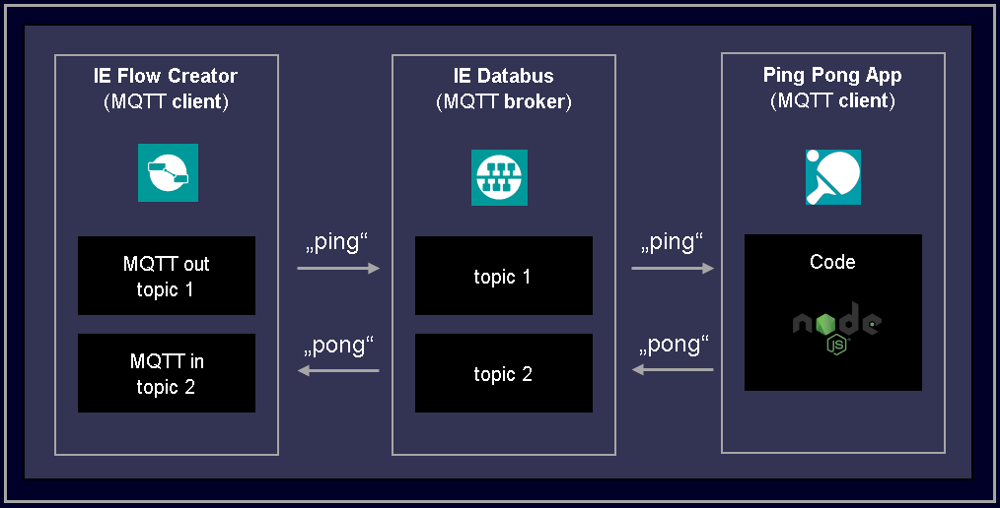
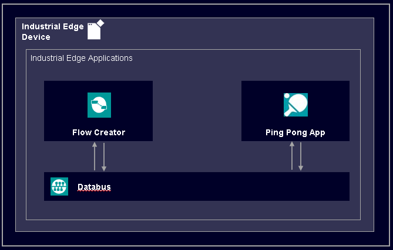
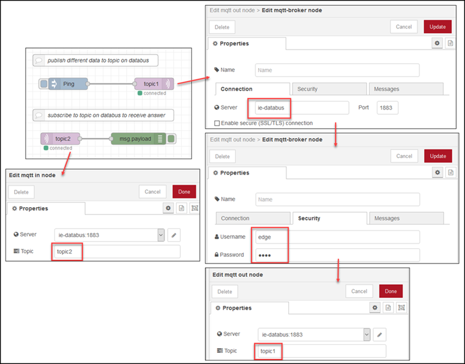

# Databus Ping Pong Node.js

This application example contains the source files to build a Databus Ping Pong application implemented in Node.js.

- [Databus Ping Pong Node.js](#databus-ping-pong-node-js)
  - [Description](#description)
    - [Overview](#overview)
    - [General task](#general-task)
  - [Requirements](#requirements)
    - [Used components](#used-components)
    - [Further requirements](#further-requirements)
  - [Installation](#installation)
  - [Usage](#usage)
  - [Documentation](#documentation)
  - [Contribution](#contribution)
  - [Licence and Legal Information](#licence-and-legal-information)

## Description

### Overview

This application example shows how to connect to the IE Databus via MQTT and how to publish and subscribe data using an implementation in Node.js.
The IE Flow Creator is used to exchange data between different topics within the IE Databus.

This implementation example uses the ``node:14.17.1-alpine`` image as the base layer and runs the provided script after installing all necessary dependencies.

This example also shows two ways of configuring the application:

- configuration via file upload (fix configuration file)
- configuration via system app Configuration Service (custom configuration UI with JSON Forms)

### General task

The application includes a MQTT client to subscribe to one topic of the IE Databus and waits to receive data. When data arrives, it publishes a corresponding answer to a second topic of the IE Databus. If it receives the string "Ping", it will answer with "Pong" and the other way around.

The names of the IE Databus topics as well as the credentials used by the application can be configured via different options, otherwise environmental variables included in the docker-compose file are used.

## Requirements

### Used components

- Industrial Edge Management (IEM) V1.2.0-36 / V1.2.14
  - IE Databus Configurator V1.2.29
  - IE Databus V1.2.16
  - IE Flow Creator V1.1.2
  - IE App Configuration Service V1.0.5
- Industrial Edge Device (IED) V1.2.0-56
- Industrial Edge App Publisher V1.2.8
- Docker Engine V20.10.3
- Docker Compose V1.28.5

### Further requirements

- IED is onboarded to a IEM
- IE Databus Configurator is deployed to the IEM
- IE Configuration Service is deployed to the IEM
- IE Databus is deployed to the IED
- IE Flow Creator is deployed to the IED

## Installation

Please refer to the [Installation](https://github.com/industrial-edge/pingpong-csharp/blob/main/docs/Installation.md#installation) section of the *Ping Pong in C#* repository on how to build and deploy the application to an IED. Just use the source files from this repository and follow the instructions.

- [Build application](https://github.com/industrial-edge/pingpong-csharp/blob/main/docs/Installation.md#build-application)
- [Configuring the Industrial Edge Databus](https://github.com/industrial-edge/pingpong-csharp/blob/main/docs/Installation.md#configuring-the-industrial-edge-databus)
- [Create configuration for the application](https://github.com/industrial-edge/pingpong-csharp/blob/main/docs/Installation.md#create-configuration-for-the-application)
- [Upload the application to the Industrial Edge Management](https://github.com/industrial-edge/pingpong-csharp/blob/main/docs/Installation.md#upload-the-application-to-the-industrial-edge-management)
- [Configuring and deploying the application to a Industrial Edge Device](https://github.com/industrial-edge/pingpong-csharp/blob/main/docs/Installation.md#configuring-and-deploying-the-application-to-a-industrial-edge-device)

## Usage

Once the application is successfully deployed to the IED, it can be tested using the IE Flow Creator.

On the IED restart the PingPong application, to ensure the right configuration is used. Then open the app IE Flow Creator and set it up as following:

- Connect an "inject" node with a "mqtt out" node
- Connect a "mqtt in" node with a "debug" node
- Configure the mqtt-nodes to connect to the databus (mqtt broker, username, password)
- Set the topics of the mqtt-nodes according to the configuration of the application (here: "topic1" to publish to, "topic2" to subscribe to)

Deploy the flow and test by injecting a string payload into the mqtt in node. If the string is "Ping", the application will answer with "Pong". If the string is "Pong" the application will answer with "Ping".

The finished flow is available [here](src/Flow_Pingpong_Test.json) and can be imported into the IE Flow Creator.

## Documentation
  
You can find further documentation and help in the following links:

- [Industrial Edge Hub](https://iehub.eu1.edge.siemens.cloud/#/documentation)
- [Industrial Edge Forum](https://www.siemens.com/industrial-edge-forum)
- [Industrial Edge landing page](https://new.siemens.com/global/en/products/automation/topic-areas/industrial-edge/simatic-edge.html)
- [Industrial Edge GitHub page](https://github.com/industrial-edge)
  
## Contribution

Thank you for your interest in contributing. Anybody is free to report bugs, unclear documentation, and other problems regarding this repository in the Issues section.
Additionally everybody is free to propose any changes to this repository using Pull Requests.

If you are interested in contributing via Pull Request, please check the [Contribution License Agreement](Siemens_CLA_1.1.pdf) and forward a signed copy to [industrialedge.industry@siemens.com](mailto:industrialedge.industry@siemens.com?subject=CLA%20Agreement%20Industrial-Edge).
## Licence and Legal Information

Please read the [Legal information](LICENSE.md).
